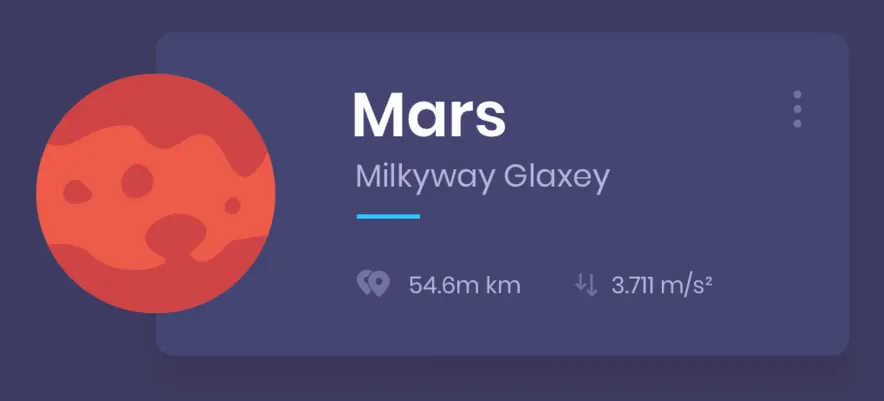

# 🌌 Planet Cards

A simple **HTML + CSS mini-project** that displays planets in a card layout.  
Each card shows a planet illustration, its name, galaxy, and some key stats (distance, gravity, etc.).

---

## 🚀 Features
- Minimal and modern UI with card-based design  
- Custom planet illustrations  
- Responsive layout (works on different screen sizes)  
- Clean typography and simple animations  

---

## 🖼️ Preview
Example card design:  



---

## 📂 Project Structure
```
planet_cards/
│── index.html        # Main HTML file
│── style.css         # CSS styling
│── assets/           # Images/icons used
│   └── planet.png
│── README.md
```

---

## ⚡ Getting Started
1. Clone or download this repository
   ```bash
   git clone https://github.com/your-username/planet_cards.git
   ```
2. Open `index.html` in your browser  
3. Enjoy exploring the planet cards 🌍✨

---

## 🎨 Customization
- Add more planets by copying a card block in `index.html`  
- Modify colors, fonts, and shadows in `style.css`  
- Replace the planet illustrations inside `assets/`  

---

## 📌 Future Improvements
- Add animations for hover effects  
- Implement a grid layout for multiple planets  
- Add interactivity with JavaScript (flip cards, expand info, etc.)  

---

## 📜 License
This project is open-source and available under the **MIT License**.

---
Made with ❤️ using **HTML + CSS**
